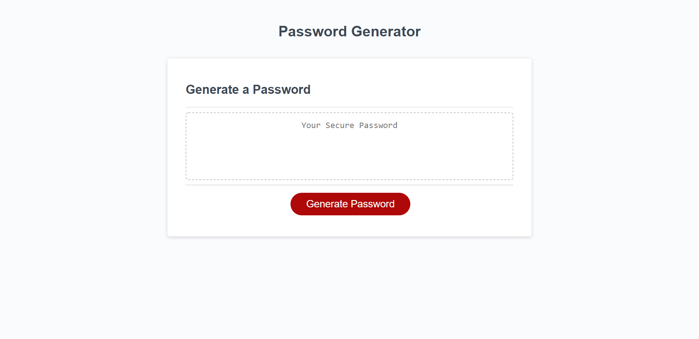

# Password Generator

## Description

-I noticed that people now a days mace many diificulties to have a safe and secure password.So,I wanted to create a password which cannnot be easily compromised.

-To achieve my goal I maade application, which can generate safe and secure passwords just by an effort of clicking the mouse button.

-It give people access to have a safe and secure and unique password.

- Java script was totally new to me, so I learned it and used it in a way which enhances my understanding of it.

## Table of contents

Installation: 
-Download and install Git bash
-Open your Git bash application
-Type in command mkdir Password generator
-By using cd command go into Password generator
-Enter git clone 

## Credits
Sachmilan Singh, David Johnson(tutor), Kevin Powel (youtube videos), Mary Kathryn(viewed her code for guidance).

## usage
-You can generate a unique, safe and secure password, by just click a button. All you have to do is to answer 5 questions, so that the application can understand your needs better, in order to provide you your much needed password.

## Features

You can create a password, which belongs to only and only you. To add more security, we included a questionary in the application, in which you can choose whether you want upper case, lower case, numbers, and special charaters in there. To give you even more security, you can even choose the lenght of your unique password, as it gives you the option to have the length of the password from 8 characters all the way to 128 characters.

## How to contribute

You can always look at the HTML code and the CSS styling which I use. I trust myself completely; however, not a single man on this earth is perfect, so if you find a better way to code the password generator or find any fault in my code, feel free to contact me on Linkedin, Github and Gmail, all you have to do is to search my name- Sachmilan Singh.

## License

Open source software license.

